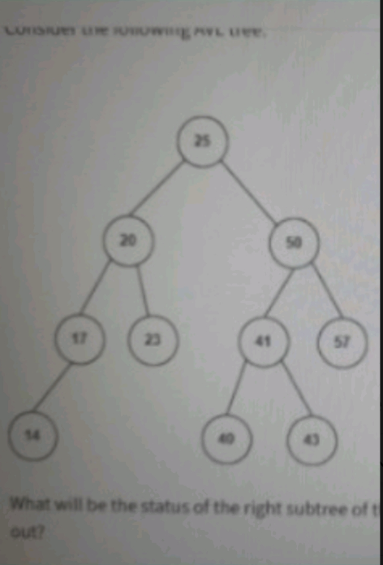

🔹 Case 1: AVL Tree – Failure in Systematic Balance Verification
📌 Category
Data Structures
________________________________________
📷 Original Question
  
________________________________________
❌ Incorrect AI Reasoning
The AI failed to correctly verify whether the given tree satisfies AVL balance conditions.
Instead of performing a systematic balance factor calculation for each node, the reasoning relied on:
•	Visual inspection of the tree
•	Assumptions about structural balance
•	Lack of step-by-step height evaluation
This led to uncertainty or incorrect conclusions regarding the balance status of the tree, particularly the right subtree.
________________________________________
🔍 Error Type
Conceptual + Procedural Error (Lack of Formal Verification Method)
________________________________________
✅ Correct Rectification
AVL trees must be validated using a bottom-up approach, computing height and balance factor at every node.
________________________________________
🔹 Step 1: Leaf Nodes
Nodes: 14, 22, 40, 43, 57
→ Height = 1
________________________________________
🔹 Step 2: Internal Nodes
•	Node 17
Left = 1, Right = 0 → Height = 2
BF = +1 ✅
•	Node 20
Left = 2, Right = 1 → Height = 3
BF = +1 ✅
•	Node 41
Left = 1, Right = 1 → Height = 2
BF = 0 ✅
•	Node 50
Left = 2, Right = 1 → Height = 3
BF = +1 ✅
________________________________________
🔹 Step 3: Root Node
•	Node 25
Left = 3, Right = 3 → Height = 4
BF = 0 ✅
________________________________________
✅ Final Conclusion
•	All nodes satisfy: Balance Factor ∈ {−1, 0, +1}
•	No imbalance exists
•	No rotations are required
👉 The tree is a valid AVL tree, including the right subtree.
________________________________________
💡 Key Insight
Correctness in AVL trees depends not on appearance, but on strict numerical verification of balance factors at every node.
________________________________________
📌 Generalized Rule
Tree-based invariants must always be validated using formal computations, not visual assumptions or intuition.
________________________________________
🌍 Real-World Impact
Failure to properly verify tree balance can lead to:
•	Incorrect implementations of balanced trees
•	Degradation of time complexity (O(log n) → O(n))
•	Inefficient database indexing and retrieval
•	Faulty behavior in systems relying on hierarchical data structures
________________________________________
🔗 Reference Discussion
https://chatgpt.com/share/687df102-0c24-8008-9607-f0d4009eae89
________________________________________
🏁 Status
✅ Rectified and rigorously verified

