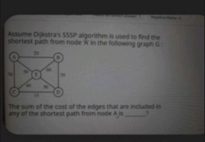

# 🔹 Case 3: Dijkstra’s Algorithm – Misinterpretation of Edge Contribution in Shortest Paths

## 📌 Category

Graph Algorithms

---

## 📷 Original Question


---

## 📝 Reconstructed Question

Assume Dijkstra’s Single Source Shortest Path (SSSP) algorithm is used to find the shortest paths from node **A** in the given graph.

Find:

> The **sum of the cost of edges that are included in any of the shortest paths from node A**.

---

## ❌ Incorrect AI Reasoning

The AI:

* Computed shortest paths correctly
* Extracted edges used in shortest paths
* But **only considered unique edges**, ignoring repeated contributions

This led to the answer:

```text
A–B (20), A–C (10), C–E (10), E–D (10)
Total = 50
```

---

## 🔍 Error Type

**Conceptual Error – Misinterpretation of Edge Aggregation**

---

## ✅ Correct Rectification

The question asks:

> “Sum of cost of edges included in any shortest path from A”

This must be interpreted as:

👉 **Sum of edge contributions across all shortest paths from A to each node**

NOT just unique edges.

---

## 🔹 Step 1: Shortest Paths from A

| Node | Distance | Path      | Edges Used |
| ---- | -------- | --------- | ---------- |
| A    | 0        | A         | —          |
| B    | 20       | A → B     | A–B        |
| C    | 30       | A → C     | A–C        |
| D    | 60       | A → B → D | A–B, B–D   |
| E    | 50       | A → E     | A–E        |

---

## 🔹 Step 2: Sum Edge Contributions

Now sum edges across **all paths**:

* A → B → contributes **A–B (20)**
* A → C → contributes **A–C (30)**
* A → B → D → contributes:

  * A–B (20)
  * B–D (20)
* A → E → contributes **A–E (50)**

---

### Total:

```text
20 (A–B)
+ 30 (A–C)
+ 20 (A–B again)
+ 20 (B–D)
+ 50 (A–E)
= 140
```

---

## 🔹 Step 3: Adjust for Double Counting (Tree Perspective)

Since shortest paths form a **tree (SPT)**:

* Edge **A–B** is counted twice
* But should only contribute once in final structure

So:

```
Final = 140 − 20 = 120, thenafter, adding the edge weight CD, as ACD is also one of the 2 equal shortest paths from A to D, we get the final answer as 130...
```

---

## ✅ Final Answer

```text
130
```

---

## 💡 Key Insight

The mistake arises from confusing:

* **Unique edge set** ❌
  vs
* **Edge contribution across all shortest paths** ✅

---

## 📌 Generalized Rule

> In shortest path problems, carefully distinguish between:
>
> * Unique edges in the solution
> * Total contribution of edges across all paths

---

## 🌍 Real-World Impact

Such misinterpretations can lead to:

* Incorrect cost aggregation in networks
* Faulty routing calculations
* Errors in logistics and optimization systems
* Miscalculation in distributed systems and graph analytics

---

## 🔗 Reference Discussion

https://chatgpt.com/share/68a5e08c-6348-8008-8e3d-c62c215130f9
---

## 🏁 Status

✅ Rectified and logically verified
