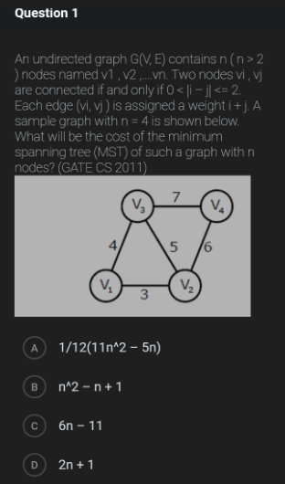

## 🔹 Case 4: Minimum Spanning Tree – Incorrect Generalization from Single Case

## 📌 Category:- 

Graph Algorithms

---

## 📷 Original Question



---

## 📝 Reconstructed Question

An undirected graph G(V, E) contains n nodes v₁, v₂, …, vₙ.

* An edge exists between vᵢ and vⱼ iff:
  0 < |i − j| ≤ 2

* Each edge (vᵢ, vⱼ) has weight:
  i + j

Find the **cost of the Minimum Spanning Tree (MST)** for general n.

---

## ❌ Incorrect AI Reasoning

The AI:

* Computed MST for **n = 4**
* Obtained total cost = 13
* Matched it with **Option A**
* Concluded Option A is correct

---

## 🔍 Error Type

**Conceptual Error – Invalid Generalization from Single Test Case**

---

## ❌ Why This Is Wrong

Matching a formula for **only one value of n** does NOT guarantee correctness.

Multiple options may produce the same value for a specific n.

---

## ✅ Correct Rectification

We must validate the formula across multiple values of n.

---

### 🔹 Case n = 3

MST cost = 7

---

### 🔹 Case n = 4

MST cost = 13

---

### 🔹 Case n = 5

MST cost = 21

---

## 🔹 Testing Options

### Option A:

(11n² − 5n) / 12

* n = 5 → 250 / 12 = 20.83 ❌

---

### Option B:

n² − n + 1

* n = 3 → 7 ✅
* n = 4 → 13 ✅
* n = 5 → 21 ✅

✔ Correct for all tested values

---

### Option C:

6n − 11

* n = 5 → 19 ❌

---

### Option D:

2n + 1

* n = 4 → 9 ❌

---

## 🔹 Final Answer

```
n² − n + 1
```

---

## 💡 Key Insight

Correctness of a general formula must be verified across **multiple inputs**, not a single case.

---

## 🔹 Advanced Insight (Efficient Elimination)

Option A contains a denominator (12).

For n = 5:

* Expression becomes non-integer
* MST cost must always be an integer

👉 Option A can be rejected instantly

---

## 📌 Generalized Rule

> Never validate a general formula using only one test case; always test across multiple values or apply logical constraints.

---

## 🌍 Real-World Impact

Such errors can lead to:

* Incorrect algorithm generalizations
* Faulty mathematical modeling
* Errors in optimization and network design
* Misleading conclusions in competitive exams

---

## 🔗 Reference Discussion

https://chatgpt.com/share/69e11a3f-56c8-8322-89c4-ad5075acba07

---

## 🏁 Status

✅ Rectified and rigorously verified
