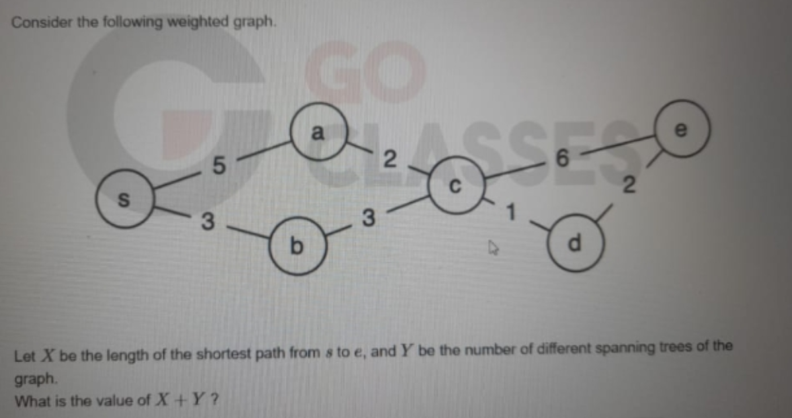

# 🔹 Case 5: Number of Spanning Trees – Misapplication of Kirchhoff’s Theorem

## 📌 Category

Graph Algorithms

---

## 📷 Original Question



---

## 📝 Reconstructed Question

Consider the given weighted graph.

Let:

* **X** = length of the shortest path from **s to e**
* **Y** = number of different spanning trees of the graph

Find the value of:

> X + Y

---

## 🔹 Step 1: Shortest Path (X)

Evaluate all possible paths from **s to e**:

* s → a → c → e = 5 + 2 + 6 = 13
* s → b → c → e = 3 + 3 + 6 = 12
* s → a → c → d → e = 5 + 2 + 1 + 2 = 10
* s → b → c → d → e = 3 + 3 + 1 + 2 = 9 ✅

### ✅ Final:

```text
X = 9
```

---

## ❌ Incorrect AI Reasoning

The AI:

* Attempted to use **Kirchhoff’s Matrix Tree Theorem**
* Constructed Laplacian matrix
* Claimed:

```text
Y = 8
```

---

## 🔍 Error Type

**Conceptual Error – Overcomplication & Incorrect Application of Matrix Method**

---

## ❌ Why This Is Wrong

* The graph has a **clear structural decomposition**
* Using determinant-based methods here:

  * Is unnecessary
  * Is error-prone
* The final value (8) is incorrect

---

## ✅ Correct Rectification

### 🔹 Step 1: Identify Graph Structure

The graph consists of:

* A **cycle of 4 nodes**:
  s → a → c → b → s

* A **cycle of 3 nodes**:
  c → d → e → c

👉 These two cycles share **exactly one common vertex: c**

---

## 🔹 Step 2: Apply Graph Decomposition Rule

For graphs composed of **independent blocks joined at a single articulation point**:

```text
Number of spanning trees = Product of spanning trees of each block
```

---

## 🔹 Step 3: Use Known Result

For a cycle with k vertices:

```text
Number of spanning trees = k
```

---

### Apply:

* 4-node cycle → 4 spanning trees
* 3-node cycle → 3 spanning trees

---

## 🔹 Final Calculation

```text
Y = 4 × 3 = 12
```

---

## ✅ Final Answer

```text
X + Y = 9 + 12 = 21
```

---

## 💡 Key Insight

Instead of blindly applying heavy formulas:

> Recognize graph structure and apply simpler, more reliable theorems.

---

## ⚡ Intuitive Insight

* Cycles behave independently when connected at a single vertex
* Their spanning tree counts multiply

---

## 📌 Generalized Rule

> If a graph is composed of multiple subgraphs connected through articulation points, the total number of spanning trees is the product of spanning trees of individual components.

---

## 🌍 Real-World Impact

Such errors can lead to:

* Incorrect network reliability analysis
* Faulty infrastructure design calculations
* Errors in probabilistic graph models
* Misinterpretation in circuit/network theory

---

## 🔗 Reference Discussion

https://chatgpt.com/share/69e1df38-2adc-83a5-8b31-ce94d5589ad3

---

## 🏁 Status

✅ Rectified using structural graph theory
