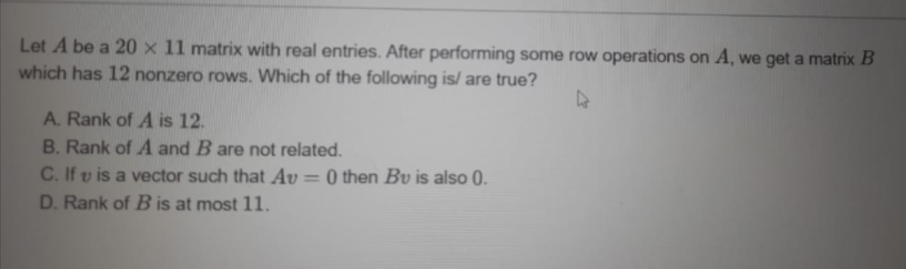

# 🔹 Case 6: Rank of a Matrix – Violation of Rank Bounds

## 📌 Category

Linear Algebra

---

## 📷 Original Question



---

## 📝 Reconstructed Question

Let **A** be a ( 20 \times 11 ) matrix with real entries.
After performing some row operations on **A**, we obtain a matrix **B** which has **12 non-zero rows**.

Which of the following is/are true?

A. Rank of A is 12
B. Rank of A and B are not related
C. If ( Av = 0 ), then ( Bv = 0 )
D. Rank of B is at most 11

---

## ❌ Incorrect AI Reasoning

The AI concluded:

* Since B has 12 non-zero rows → Rank(B) = 12
* Rank(A) = Rank(B) = 12
* Final Answer: **A, C, D**

---

## 🔍 Error Type

**Fundamental Conceptual Error – Ignoring Rank Upper Bound**

---

## ❌ Why This Is Wrong

### 🔴 Key Violation:

```text
Rank ≤ min(number of rows, number of columns)
```

For matrix B:

* Size = ( 20 \times 11 )

```text
Rank(B) ≤ min(20, 11) = 11
```

👉 So **Rank(B) = 12 is IMPOSSIBLE**

---

## 🔴 Additional Mistake

The AI assumed:

> Number of non-zero rows = rank

❌ This is only valid if:

* Matrix is in **row echelon form**

👉 The question **does NOT state** that B is in echelon form.

---

## ✅ Correct Rectification

### 🔹 Step 1: Rank Bound

```text
Rank(A), Rank(B) ≤ 11
```

---

### 🔹 Step 2: Analyze Options

---

### ❌ Option A: Rank of A is 12

Impossible due to rank bound.

```text
FALSE
```

---

### ❌ Option B: Rank of A and B are not related

Row operations preserve rank:

```text
Rank(A) = Rank(B)
```

```text
FALSE
```

---

### ✅ Option C: If Av = 0 ⇒ Bv = 0

Since:

```text
B = P A  (P is invertible)
```

Then:

```text
Bv = P(Av) = 0
```

```text
TRUE
```

---

### ✅ Option D: Rank of B is at most 11

Directly from rank bound:

```text
TRUE
```

---

## ✅ Final Answer

```text
Correct Options: C and D
```

---

## 💡 Key Insights

* Rank is always bounded by **minimum dimension**
* Row operations **preserve rank**, but do NOT increase it
* Non-zero rows ≠ rank (unless in echelon form)

---

## ⚡ Core Concept Failure

The AI:

* Ignored a **hard mathematical constraint**
* Trusted a **derived property without checking conditions**

---

## 🌍 Real-World Impact

Such errors can lead to:

* Incorrect solutions in machine learning models (matrix rank is crucial)
* Faulty dimensionality reduction (PCA, SVD)
* Errors in system solvability (linear equations)
* Misinterpretation of data structure rank

---

## 🔗 Reference Discussion

https://chatgpt.com/share/68ab0830-2884-8008-a203-a5d8b1803da7

---

## 🏁 Status

✅ Rectified using fundamental linear algebra constraints
