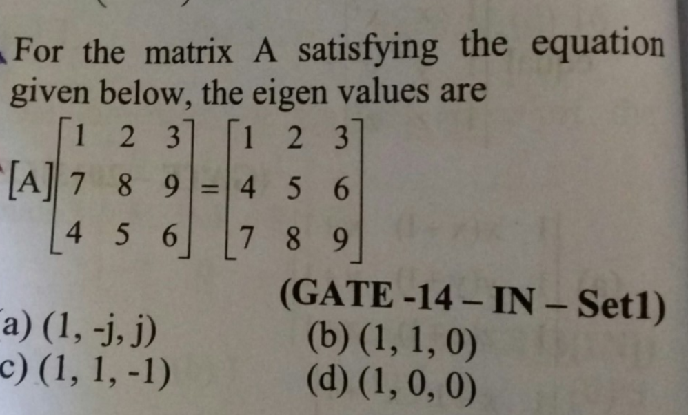

🔹 Case 10: Eigenvalues – Misinterpretation of Matrix Transformation
📌 Category  
Linear Algebra  
________________________________________  

📷 Original Question  
  
________________________________________  

❌ Incorrect AI Reasoning  
The AI incorrectly interpreted the given matrix transformation as a **cyclic row shift**, leading to the conclusion that the eigenvalues are complex roots of unity.

Instead of identifying the exact transformation, the reasoning relied on:
• Incorrect structural assumption (cyclic shift instead of row swap)  
• Pattern matching rather than verification  
• No validation using determinant or matrix properties  

This resulted in selecting incorrect eigenvalues.  
________________________________________  

🔍 Error Type  
Conceptual Error (Incorrect Transformation Identification)  
________________________________________  

✅ Correct Rectification  
The correct approach is to identify the transformation and use determinant properties for validation.  
________________________________________  

🔹 Step 1: Observe Transformation  

Matrix \( Y \) is obtained from \( X \) by **swapping two rows (Row 2 ↔ Row 3)**  

________________________________________  

🔹 Step 2: Determinant Relation  

\[
|A| \cdot |X| = |Y|
\]

Since one row swap changes determinant sign:

\[
|Y| = -|X|
\]

________________________________________  

🔹 Step 3: Compute Determinant of A  

\[
|A| = -1
\]

________________________________________  

🔹 Step 4: Eigenvalue Property  

\[
\lambda_1 \cdot \lambda_2 \cdot \lambda_3 = \det(A) = -1
\]

________________________________________  

🔹 Step 5: Eliminate Options  

• A → Product = +1 ❌  
• B → Product = 0 ❌  
• D → Product = 0 ❌  
• C → Product = -1 ✅  

________________________________________  

✅ Final Conclusion  
• Only one option satisfies determinant condition  
• Eigenvalues are: (1, 1, -1)  
• AI’s cyclic assumption was incorrect  

👉 Correct Answer: **Option C**  
________________________________________  

💡 Key Insight  
Matrix transformations must be **explicitly verified**, not assumed from patterns.  

Determinant provides a **necessary condition** that can directly eliminate incorrect options.  
________________________________________  

📌 Generalized Rule  
Always identify the exact linear transformation before applying eigenvalue intuition.  

Shortcuts like determinant checks are powerful, but must be applied correctly.  
________________________________________  

🌍 Real-World Impact  
Misinterpreting matrix transformations can lead to:  
• Incorrect system modeling  
• Faulty eigen-analysis in engineering problems  
• Errors in stability analysis  
• Misjudgment in control systems and data transformations  
________________________________________  

🔗 Reference Discussion  
https://chatgpt.com/share/68f078d6-5c80-8008-af39-e76b1431062d
________________________________________  
